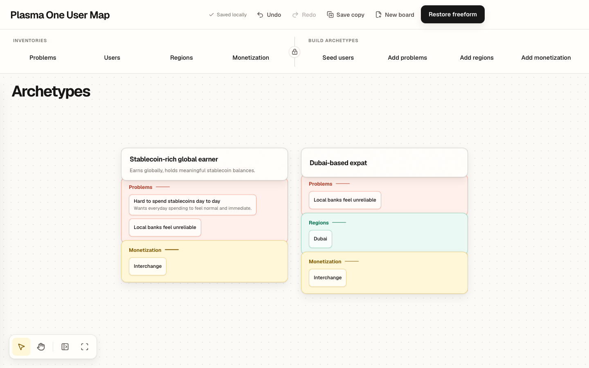

# Plasma One User Map

A tactile, local-first workshop for turning a room full of product hypotheses into a small set of clear user archetypes.

[Open the workshop](https://nathanplasma.github.io/plasma-one-user-map/)



The tool is intentionally narrower than a generic whiteboard. It first helps a facilitator list and cluster four vocabularies independently: Problems, Users, Regions and Monetization. Once those inventories are locked, it turns each User into an independent island and lets the facilitator copy the relevant layers into it. There are no graph lines and no requirement that everything connect.

## Workshop flow

1. Build and categorise the four independent inventories, then lock `Inventory v1`.
2. Assemble layered User archetypes, then optionally Tidy the field for the final read.

## Product principles

- Blank by default. No templates, scores or suggested answers.
- Independent inventories first, composable archetypes second.
- Shelf drag copies. Local drag moves. Duplication is always explicit.
- Every source stays immutable after lock; every placed copy can be edited locally.
- IndexedDB saves complete, validated generations atomically.
- Undo never crosses the lock boundary after Phase 2 begins.
- Keyboard alternatives exist for every session-critical drag action.
- Reduced motion and reduced transparency are respected.
- No accounts, backend, multiplayer, AI, voting or analytics.

## Run locally

Requires Node.js 22 or newer.

```bash
npm ci
npm run dev
```

Open `http://127.0.0.1:5173`.

## Verify

```bash
npm run format:check
npm run lint
npm run typecheck
npm test
npm run test:e2e
npm run build
```

The browser suite covers Chromium at 1440×900 and 1024×768, plus a WebKit smoke pass.

## Architecture

- React + TypeScript + Vite
- React Flow nodes for the freeform canvases, with no edges
- Zustand and Immer patches for named commands and phase-specific history
- IndexedDB generations validated by Zod and domain invariants
- dnd-kit for copy, move and reorder gestures
- Vitest, Testing Library, Playwright and axe for verification

The app is a static site. GitHub Actions verifies the repository and deploys `main` to GitHub Pages.

The password prompt is a client-side privacy screen, not server-side authentication. It keeps the workshop hidden during ordinary sharing and remembers access only for the current browser tab session. GitHub Pages still serves the public application bundle.

## Data and recovery

Workshop data stays in the current browser profile. `Save copy` exports a validated JSON checkpoint. `Open copy` previews and opens that file as a new local generation without silently replacing the current board. The displaced board remains available from New board, then Restore previous board. Opening validates the V1 schema, relationships, file size, field lengths, and generous workshop entity limits before changing the current board.

Use a dedicated browser profile for sensitive workshops.

If storage is corrupt or another tab writes a newer generation, the app refuses to overwrite the unknown state and offers recovery/export controls.

## License

MIT
